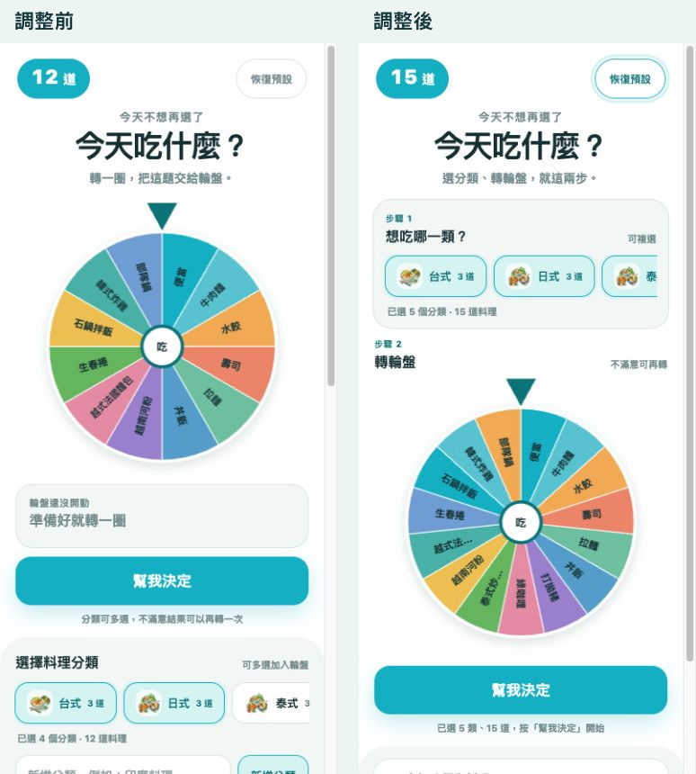

# 003 美食輪盤操作稽核

稽核日期：2026-08-28
測試環境：行動版 390 × 844、本機預覽

## 任務走查

1. 找到開始操作的位置。
2. 選擇料理分類。
3. 轉動輪盤並查看結果。
4. 需要時修改分類或查看過往筆記。

## 原始狀態

## 發現與修正

| 優先度 | 發現 | 對操作的影響 | 修正 |
| --- | --- | --- | --- |
| 高 | 分類選擇排在輪盤和主要按鈕之後 | 使用者容易先按輪盤，卻不知道選項從哪裡控制 | 將分類選擇移到輪盤之前，標示為步驟 1 |
| 高 | 編輯分類、編輯料理、五組筆記全部展開 | 主流程和進階功能沒有層級，頁面顯得很長 | 自訂與筆記各自預設收合 |
| 中 | 按鈕下方只說明可複選／再轉 | 無法確認目前是否已準備好 | 顯示已選分類數、料理數與下一步指令 |
| 中 | 結果中的筆記按鈕只捲動到筆記 | 筆記若收合，使用者仍看不到內容 | 按下後自動展開對應筆記並捲動定位 |

## 結論

保留全部能力，但把預設路徑收斂成「選分類 → 轉輪盤」；自訂資料與口袋名單改為按需展開，讓第一次使用者不必先理解資料結構。

## 調整前後

